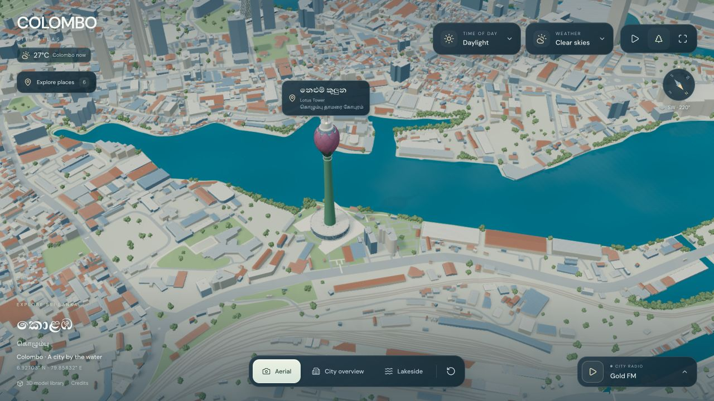
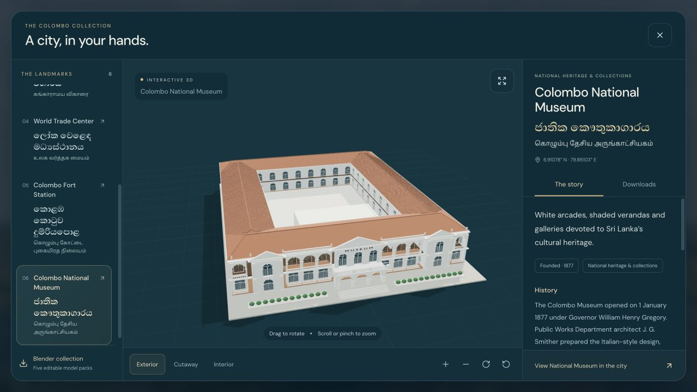
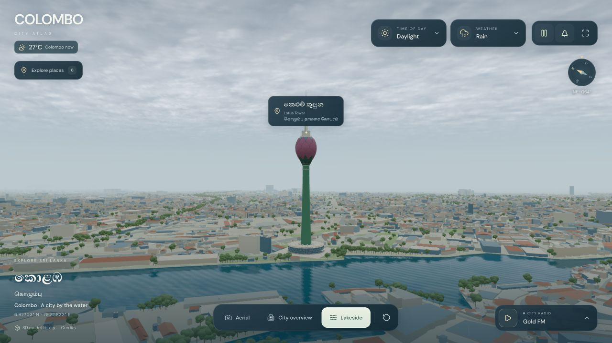
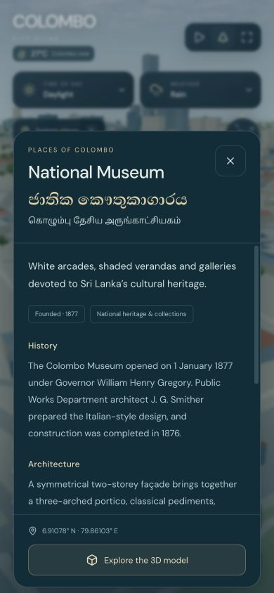

# Colombo Atlas

**A little bit of Colombo, in your browser.**

The idea is simple. Open the map, put on some radio, and spend a little time in Colombo.
Move around Beira Lake, get closer to Lotus Tower, or explore the old railway station.
Change the light, bring in some rain, and see the city from another angle.

**[Explore Colombo Atlas](https://colombo.prabhavalabs.com)**



## What you can do

- **Explore the city in 3D.** Drag to rotate, scroll or pinch to zoom, and switch between aerial, city and lakeside views. The compass shows which direction you are facing.
- **Get to know the landmarks.** Pick a place and fly straight to its own camera view. Once you arrive, tap the small story prompt to read about its history, architecture and significance. Names appear in Sinhala, Tamil and English, with coordinates below.
- **Set the mood.** Try morning light, soft daylight or golden hour. Choose clear skies, clouds, rain, heavy rain or a thunderstorm. The sky, shadows, water and surface wetness change together.
- **Put on some radio.** Listen to Gold FM, Sun FM or Hiru FM. Sirasa FM opens in its official player. There are English and Sinhala filters, volume controls and a stop button.
- **See Colombo's current temperature.** The small weather badge uses Open-Meteo. It shows real conditions in Colombo; the weather controls let you choose the atmosphere of the 3D scene.
- **Take a closer look at the models.** Open the model library, rotate an object, zoom in and expand the viewer. Download a GLB, an editable Blender file or a complete model pack where available.

## A closer look

The model library has six landmarks: **Lotus Tower, Altair, Gangaramaya Temple,
World Trade Center, Colombo Fort Station and the National Museum.**

The Station and Museum include selected interiors and a cutaway view. You can
look inside the ticket hall or explore the Museum's staircase, then switch back
to the exterior. The collection and stories scroll inside the workspace, so the
main controls stay easy to reach.



Five landmarks come with separate Blender source files and model packs. Lotus
Tower is available as the existing city GLB. Its file uses Meshopt compression,
so it needs a compatible 3D viewer.

<table>
  <tr>
    <td width="68%"></td>
    <td width="32%"></td>
  </tr>
  <tr>
    <td>A different mood by the lake.</td>
    <td>The same city, on a smaller screen.</td>
  </tr>
</table>

## Run it locally

You need **Node.js 22.12 or newer** and npm.

```sh
git clone https://github.com/theetaz/colombo-atlas.git
cd colombo-atlas
npm ci
npm run dev
```

Open [localhost:5174](http://localhost:5174). No API key or account is needed.
The repository includes the map assets and Blender files, so the first clone
is larger than a typical frontend project.

To try it on a phone connected to the same Wi-Fi:

```sh
npm run dev -- --host 0.0.0.0
```

Open the **Network** address printed by Vite on your phone. The normal dev command
listens only on your own computer.

## A few useful controls

| Action | Control |
| --- | --- |
| Rotate the map or a model | Drag with one finger or the left mouse button |
| Zoom | Pinch, scroll, or use the model viewer's + / − buttons |
| Find a landmark | Click a map tag or open **Explore places** |
| Restore the camera | Press the reset button |
| Read a place's story | Fly to it, then choose **Tap for its story** |
| Find controls on a small screen | Open **Menu** for places, weather, lighting, views, radio and downloads |
| Inspect and download an object | Open **3D model library**, then **Downloads** |
| Start or pause rain and water motion | Use the atmosphere play / pause button |
| Navigate without a mouse | Use Tab, arrow keys and Escape; the model canvas also supports + / − and Home |

## Built to take a breather

Atmospheric motion starts paused. When the camera settles, the map stops
rendering until something changes. Animation is limited to 30 fps, drawing
resolution is capped, and hidden tabs pause their rendering.

The model library loads one detailed object at a time and pauses the city behind
it. Closing the library releases its graphics resources. Mobile layouts have
scrollable panels and an expanded model view. On small screens, the map controls
stay inside one menu, leaving more room to explore the city.

The city is still a fairly detailed 3D scene. The main map loads about 33 MB of
models and placement data, followed by about 19 MB for the distant skyline.
Weather and radio need an internet connection. Radio streams are run by their
broadcasters and may occasionally be unavailable.

## Development

Built with **React, Three.js and Vite**. The landmark sources are made in **Blender**.

```sh
npm test          # Check geometry, camera framing, weather data and asset files
npm run build     # Create the static website in dist/
npm run preview   # Preview the production build locally
```

The build can be served from the root of a static website. The current asset URLs
expect a root deployment, rather than a nested path such as `/colombo-atlas/`.

| Folder | What's inside |
| --- | --- |
| `src/` | Map, shaders, model viewer, radio, weather and interface |
| `public/map/` | City models, tree placements, camera data and credits |
| `public/landmarks/` | Individual models, Blender sources, previews and downloads |
| `models/` | The original editable Blender city |
| `data/` | Geographic working data and its sources |
| `scripts/` | Landmark builders, lettering and packaging tools |
| `docs/` | Screenshots and model-building notes |

For rebuilding the models or adjusting their details, see [Working with the models](docs/MODELS.md).

The live site runs on Cloudflare Pages, with R2 serving the larger map and download
files. See [Deploying Colombo Atlas](docs/DEPLOYMENT.md) for the setup and update command.

## Credits and accuracy

The city brings together data from [OpenStreetMap contributors](https://www.openstreetmap.org/copyright),
[CMC / Sri Lanka NSDI](https://gisapps.nsdi.gov.lk/server/rest/services/SLNSDI/CMC/MapServer),
[Overture Maps](https://docs.overturemaps.org/guides/buildings/) and
[Mapzen Terrain Tiles](https://github.com/tilezen/joerd/blob/master/docs/attribution.md).
[Poly Haven](https://polyhaven.com/) provided source environment and material assets.
Live temperature comes from [Open-Meteo](https://open-meteo.com/).

Sinhala uses **Abhaya Libre**, Tamil uses **Noto Sans Tamil**, and the interface uses
**DM Sans** and **Rajdhani**. Font licences are included in [public/fonts](public/fonts/).
Radio playback comes from the broadcasters' own players and streams.

The map follows real geography, with a mix of source and estimated building heights.
Façades, planting, interiors and fine details are visual interpretations. The
water shading is not a depth survey, and the lighting presets are not live sun
positions. This is a place to explore, not a surveyed model for navigation or construction.

Landmark cards and model notes link to their references. Reference photographs
are not included in the model downloads. Please read the source terms and each
model's reuse notes before redistributing assets; a general redistribution
licence has not been assigned to the project or its original models.

If you know Colombo well and spot something we can improve, [open an issue](https://github.com/theetaz/colombo-atlas/issues).
A better name, a missing detail or a clearer reference can all help make this little city better.
